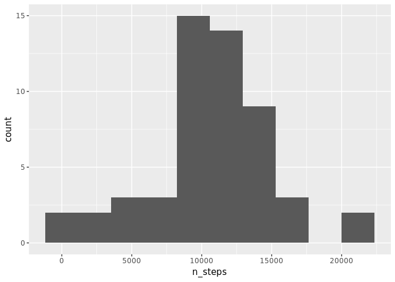

# Reproducible Research: Peer Assessment 1


```r
library(ggplot2)
library(dplyr, quietly = T)
```

```
## 
## Attaching package: 'dplyr'
```

```
## The following objects are masked from 'package:stats':
## 
##     filter, lag
```

```
## The following objects are masked from 'package:base':
## 
##     intersect, setdiff, setequal, union
```

```r
Sys.setlocale("LC_TIME",  "C")
```

```
## [1] "C"
```


## Loading and preprocessing the data


```r
data <- read.csv(unzip("activity.zip"))
head(data)
```

```
##   steps       date interval
## 1    NA 2012-10-01        0
## 2    NA 2012-10-01        5
## 3    NA 2012-10-01       10
## 4    NA 2012-10-01       15
## 5    NA 2012-10-01       20
## 6    NA 2012-10-01       25
```

```r
 class(data$date)
```

```
## [1] "factor"
```

```r
 data$date <- as.Date(data$date)
```

## What is mean total number of steps taken per day?

Histogram

```r
steps_day <-
  data %>% 
  group_by(date) %>% 
  summarise(n_steps = sum(steps))

ggplot(steps_day, aes(x = n_steps)) + 
  geom_histogram(bins = 10)
```

```
## Warning: Removed 8 rows containing non-finite values (stat_bin).
```

<!-- -->

Mean 

```r
mean(steps_day$n_steps, na.rm = TRUE)
```

```
## [1] 10766.19
```

```r
median(steps_day$n_steps, na.rm = TRUE)
```

```
## [1] 10765
```


## What is the average daily activity pattern?

```r
steps_interval <-
  data %>% 
  group_by(interval) %>% 
  summarise(mean_n_steps = mean(steps, na.rm = T))

ggplot(steps_interval, aes(x = interval, y = mean_n_steps)) + 
  geom_line()
```

<!-- -->


```r
steps_interval$interval[which.max(steps_interval$mean_n_steps)]
```

```
## [1] 835
```

## Imputing missing values


```r
sum(is.na(data$steps))
```

```
## [1] 2304
```


```r
new_data <- 
  data %>% 
  inner_join(steps_interval) %>% 
  mutate(steps = ifelse(is.na(steps), mean_n_steps, steps)) %>% 
  select(-mean_n_steps)
```

```
## Joining, by = "interval"
```

Histogram

```r
steps_day <-
  new_data %>% 
  group_by(date) %>% 
  summarise(n_steps = sum(steps))

ggplot(steps_day, aes(x = n_steps)) + 
  geom_histogram(bins = 10)
```

<!-- -->

Mean 

```r
mean(steps_day$n_steps, na.rm = TRUE)
```

```
## [1] 10766.19
```

```r
median(steps_day$n_steps, na.rm = TRUE)
```

```
## [1] 10766.19
```

## Are there differences in activity patterns between weekdays and weekends?


```r
new_data$day <- as.factor(ifelse(weekdays(new_data$date) %in% c("Saturday", "Sunday"), "weekend", "weekday"))

steps_interval <-
  new_data %>% 
  group_by(day, interval) %>% 
  summarise(mean_n_steps = mean(steps, na.rm = T))

ggplot(steps_interval, aes(x = interval, y = mean_n_steps)) + 
  geom_line() +
  facet_grid(day ~ .)
```

<!-- -->


