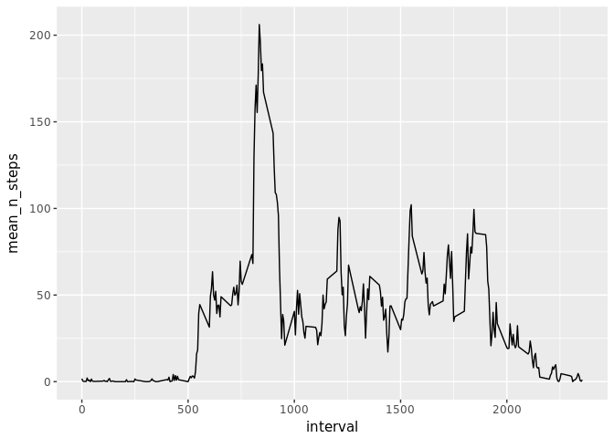
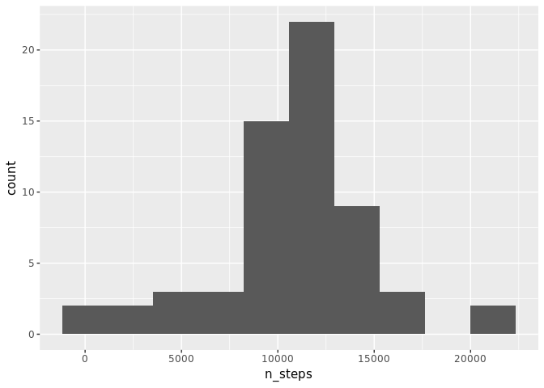

# Reproducible Research: Peer Assessment 1

## Introduction


It is now possible to collect a large amount of data about personal movement using activity monitoring devices such as a Fitbit, Nike Fuelband, or Jawbone Up. These type of devices are part of the “quantified self” movement – a group of enthusiasts who take measurements about themselves regularly to improve their health, to find patterns in their behavior, or because they are tech geeks. But these data remain under-utilized both because the raw data are hard to obtain and there is a lack of statistical methods and software for processing and interpreting the data.  

This assignment makes use of data from a personal activity monitoring device. This device collects data at 5 minute intervals through out the day. The data consists of two months of data from an anonymous individual collected during the months of October and November, 2012 and include the number of steps taken in 5 minute intervals each day.


```r
#We load the libraries we are going to use
library(ggplot2)
library(dplyr)
```

```
## 
## Attaching package: 'dplyr'
```

```
## The following objects are masked from 'package:stats':
## 
##     filter, lag
```

```
## The following objects are masked from 'package:base':
## 
##     intersect, setdiff, setequal, union
```

```r
Sys.setlocale("LC_TIME",  "C") #For setting date and time names in english, not spanish 
```

```
## [1] "C"
```


## Loading and preprocessing the data


```r
#We download, unzip and read the data 
download.file(url="https://d396qusza40orc.cloudfront.net/repdata%2Fdata%2Factivity.zip", "activity.zip")
data <- read.csv(unzip("activity.zip"))

#We explore the basic characteristics of the dataset
str(data)
```

```
## 'data.frame':	17568 obs. of  3 variables:
##  $ steps   : int  NA NA NA NA NA NA NA NA NA NA ...
##  $ date    : Factor w/ 61 levels "2012-10-01","2012-10-02",..: 1 1 1 1 1 1 1 1 1 1 ...
##  $ interval: int  0 5 10 15 20 25 30 35 40 45 ...
```

```r
head(data)
```

```
##   steps       date interval
## 1    NA 2012-10-01        0
## 2    NA 2012-10-01        5
## 3    NA 2012-10-01       10
## 4    NA 2012-10-01       15
## 5    NA 2012-10-01       20
## 6    NA 2012-10-01       25
```

```r
 class(data$date)
```

```
## [1] "factor"
```

```r
 data$date <- as.Date(data$date) #We format date variable 
```

## What is mean total number of steps taken per day?

We are going to use functions from the `dplyr` package to summarise the total number of steps per day. We represent this new calculated data in a histogram.

```r
steps_day <-
  data %>% 
  group_by(date) %>% 
  summarise(n_steps = sum(steps))

ggplot(steps_day, aes(x = n_steps)) + 
  geom_histogram(bins = 10)
```

```
## Warning: Removed 8 rows containing non-finite values (stat_bin).
```

<!-- -->

We also use the summarised data to calculate mean and median number of steps per day

```r
mean_steps <- mean(steps_day$n_steps, na.rm = TRUE)
median_steps <-median(steps_day$n_steps, na.rm = TRUE)
```
The mean number of steps per day is **10766.19** and the median is **10765**

## What is the average daily activity pattern?
We use again the `dplyr` function to summarise the total steps per time interval and then plot them in a line graph.

```r
steps_interval <-
  data %>% 
  group_by(interval) %>% 
  summarise(mean_n_steps = mean(steps, na.rm = T))

ggplot(steps_interval, aes(x = interval, y = mean_n_steps)) + 
  geom_line()
```

<!-- -->

To look for the interval with bigger average number of steps we use `which.max` function. 

```r
steps_interval$interval[which.max(steps_interval$mean_n_steps)]
```

```
## [1] 835
```
So the busiest time of the day is in themorning at 8:35 am.

## Imputing missing values
In our dataset there are a lot of missing values for the steps variable.

Exactly:

```r
sum(is.na(data$steps))
```

```
## [1] 2304
```

We are going to impute this values using the interval mean. We prefer to use the interval mean and not the day mean as we think the differences during the day (for example between nighttime ans daytime) are bigger than the diferences between days.

To do it we join the dataset with the previously created `steps_interval` data.frame.

```r
new_data <- 
  data %>% 
  inner_join(steps_interval) %>% 
  mutate(steps = ifelse(is.na(steps), mean_n_steps, steps)) %>% 
  select(-mean_n_steps)
```

```
## Joining, by = "interval"
```

We repeat the code in the first section with the new data.

```r
steps_day <-
  new_data %>% 
  group_by(date) %>% 
  summarise(n_steps = sum(steps))

ggplot(steps_day, aes(x = n_steps)) + 
  geom_histogram(bins = 10)
```

<!-- -->

Mean 

```r
mean(steps_day$n_steps, na.rm = TRUE)
```

```
## [1] 10766.19
```

```r
median(steps_day$n_steps, na.rm = TRUE)
```

```
## [1] 10766.19
```

There are not big differences between the results we obtain with missing values and with imputed values: the histogram look similar but frequency of days are bigger with imputed values. Mean does not change and median only by less than two steps.

## Are there differences in activity patterns between weekdays and weekends?
To compare the activity patterns between weekdays and weekends first we need to create a factor variable.

```r
new_data$typeday <- as.factor(ifelse(weekdays(new_data$date) %in% c("Saturday", "Sunday"), "weekend", "weekday"))
```
Then, we summarise the data grouping by type of day (weekend or weekday) and interval.
Finally we plot the results.

```r
steps_interval <-
  new_data %>% 
  group_by(typeday, interval) %>% 
  summarise(mean_n_steps = mean(steps, na.rm = T))

ggplot(steps_interval, aes(x = interval, y = mean_n_steps)) + 
  geom_line() +
  facet_grid(typeday ~ .)
```

<!-- -->
